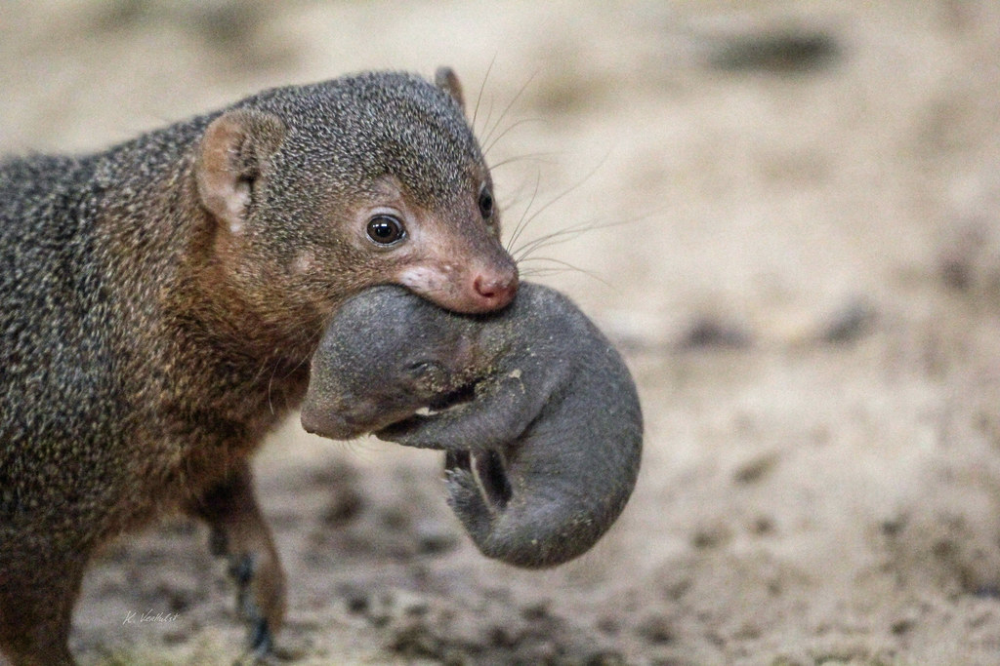
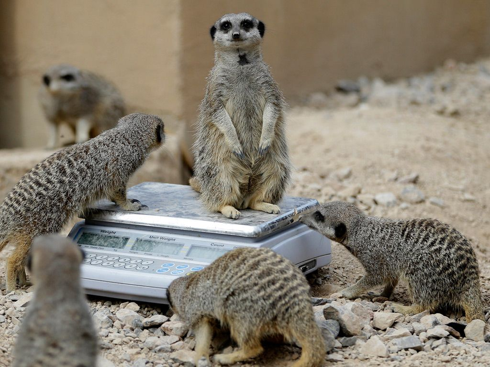

```{r load libraries, message=FALSE, warning=FALSE}

library(tidyverse)
library(lme4)
library(lmerTest)
library(emmeans)
library(ggplot2)
library(performance)
install.packages("ggplot2")
```
<body style="background-color:pink;">



I will begin with an example of a "simple repeated measures" mixed model. This study investigated the effects of liter season (spring, fall) and species (meerkat, mongoose) on liter size. A total of 6 meerkats and 6 mongoose were sampled for two seasons.

```{r import data, message=FALSE}
animals <- read_csv("meerkats.csv")
View(animals)
```

Firstly, I summarized the dataset by species and liter season. 

```{r summarize data and plot, message=FALSE}
summary <- animals %>%
  group_by(species, liter.season) %>%
  summarise(n = n(),
           mean_liter.size=mean(liter.size),
           se_liter.size=sd(liter.size)/sqrt(n()))
            
summary
```

I then ran my mixed model with liter size as my predictor variable, species and liter size as fixed effects and id as a random effect.

```{r}
mixed_animals <- lmer(liter.size ~ species*liter.season +(1|id), data = animals)

anova(mixed_animals)
```

```{r}
summary(mixed_animals)
```

We can see here that both species and liter season have a significant influence on liter size. We can also see that according to the estimates, mongoose are estimated to have around 1 less offspring per liter than meerkats. For both species, spring allows liter sizes to increase by around 1. 

```{r check model, fig.width=9.5, fig.height=9, message=FALSE}
library(see)
performance::check_model(mixed_animals)
```

Next, I calculated the model-adjusted means.

```{r emmeans}
mixed_animals_emm <- emmeans(mixed_animals, "species", "liter.season")
mixed_animals_emm
```

Because this was a balanced experiement, we can see that the model adjusted means are identical to the raw means but I continued to make a data frame in order to plot. 

```{r emmeans as dataframe}
data_emm <- as.data.frame(summary(mixed_animals_emm))
data_emm
```
```{r plot emmeans}
data_emm$liter.season <- factor(data_emm$liter.season, levels = c("Spring", "Fall"))

p<- ggplot(data_emm, aes(x=liter.season, y=emmean, group=species, color=species)) + 
  geom_line() +
  geom_point(size=4)+
  geom_errorbar(aes(ymin=emmean-SE, ymax=emmean+SE), width=.2)+
  labs(title="Liter Size(marginal means +/- 1 SE)", x="Year", y = "Liter Size")
p
```

Lastly, I ran a pairwise function to show seasonal contrasts between species and species contrasts between seasons.


```{r seasonal contrasts BETWEEN species}
pairs(emmeans(mixed_animals, "species", "liter.season"))
```

```{r species contrasts BETWEEN seasons}
pairs(emmeans(mixed_animals, "liter.season", "species"))
```

```{r}
emmeans(mixed_animals_emm, specs = pairwise ~ species:liter.season)
```


I will now show an example of a "hierarchical" mixed model. This study wanted to determine the relationship between group and parasite richness. Two fecal samples were taken for each individual and parasite richness was recorded for each sample. There were a total of six meerkats in three different groups. 

```{r, message=FALSE}
meerkats <- read_csv("meerkats2.csv")
View(meerkats)
```

Firstly, I plotted the raw data.

```{r plot, warning=FALSE}
ggplot(meerkats, aes(group, parasite.richness, colour = as.factor(id), shape=as.factor(fecal.sample))) + 
  geom_jitter(width =0.15, size=5) +
  ylim(0,10) +
  ylab("Parasite Richess") +
  xlab("Group") 
```

Next, I ran my mixed model with parasite richness as my predictor variable, group as the fixed effect and id as the random effect.

```{r,warning=FALSE}
mixed_meerkats <- lmer(parasite.richness ~ group + (1|group/id), data = meerkats)
summary(mixed_meerkats)
```

For a 1 unit increase in parasite richness for an individual in group A, there is a decrease in two parasites for individuals in group B, and a 2 parasite increase for individuals in group C.

```{r summarize data, message=FALSE}
summary <- meerkats %>%
  group_by(group) %>%
  summarise(n = n(),
           mean_parasite.richness=mean(parasite.richness),
           se_parasite.richness=sd(parasite.richness)/sqrt(n()))
            
summary
```

Next, I calculated the model-adjusted means.

```{r}
mixed_meerkats_emm <- emmeans(mixed_meerkats,"group")
mixed_meerkats_emm
```


Again, since this was also a balanced experiment, the ajusted means were identical to the raw means. Now, lets plot the means.

```{r}
data_emm2 <- as.data.frame(summary(mixed_meerkats_emm))

data_emm2
```

```{r, message = FALSE, warning = FALSE}
p2 <- ggplot(data_emm2, aes(x=group, y= emmean)) + 
  geom_line() +
  geom_point(size=4, color = "pink")+
  geom_errorbar(aes(ymin=emmean-SE, ymax=emmean+SE), width=.2)+
  labs(title="Parasite Richness (marginal means +/- 1 SE)", x="Group", y = "Parasite Richness")
p2
```
